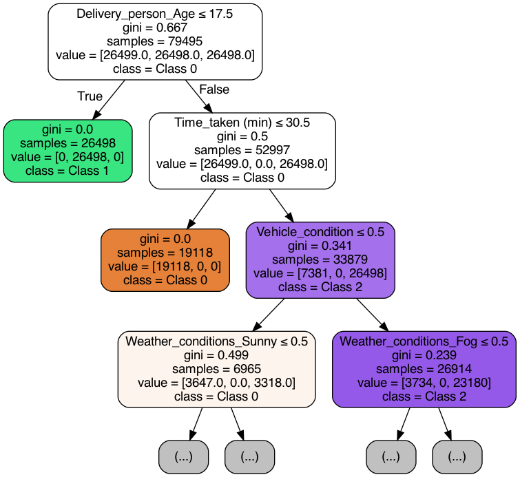
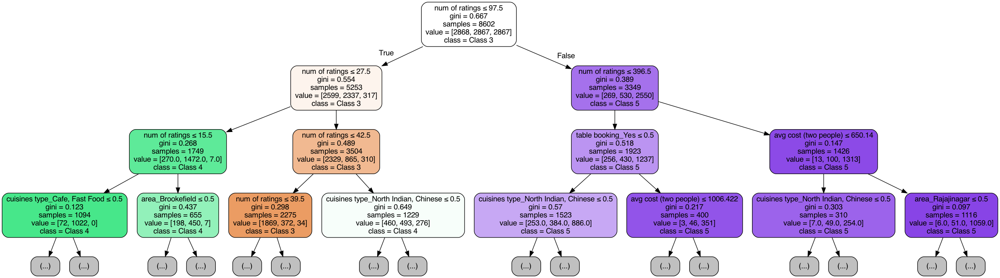

# Machine Learning Project - Decision Tree, k-NN, and Naive Bayes

## Project Overview

This project explores three machine learning algorithms—Decision Tree, k-Nearest Neighbors (k-NN), and Naive Bayes—applied to two datasets: **Delivery Dataset** and **Restaurant Dataset**. The process includes data preprocessing, model training, evaluation, and visualization of performance metrics.

## Table of Contents

1. [Project Structure](#project-structure)
2. [Datasets](#datasets)
3. [Requirements](#requirements)
4. [Installation and Setup](#installation-and-setup)
5. [Usage](#usage)
6. [Results](#results)
7. [Outputs](#outputs)
8. [License](#license)

## Project Structure

- **`data_loader.py`**: Manages data loading and preprocessing, including encoding.
- **`decision_tree_model.py`**: Implements Decision Tree training and visualization.
- **`DecisionTree.py`**: Main script to execute the project, allowing dataset and model selection.
- **`model_evaluation.py`**: Provides model evaluation metrics.

## Datasets

1. **Delivery Dataset**: Features related to delivery service efficiency.
2. **Restaurant Dataset**: Includes restaurant ratings, costs, and other area-related details.

Preprocessed data files are organized as follows:
```plaintext
    Datasets/
└── preprocessed_data/
├── delivery/
│   ├── X_train.csv
│   ├── X_valid.csv
│   ├── X_test.csv
│   ├── y_train.csv
│   ├── y_valid.csv
│   ├── y_test.csv
└── restaurant/
    ├── X_train.csv
    ├── X_valid.csv
    ├── X_test.csv
    ├── y_train.csv
    ├── y_valid.csv
    ├── y_test.csv
```

## Requirements

- **Python**: 3.7+
- **Libraries**:
  - `pandas`
  - `numpy`
  - `scikit-learn`
  - `matplotlib`

### Install dependencies

```bash
pip install -r requirements.txt
```

## Installation and Setup

1.	Clone the repository:

    ```bash
    git clone <repository_url>
    cd <repository_folder>
    ```

2.	Add datasets to the Datasets/preprocessed_data/ directory.

3.	Run the project:
    ```bash
    python DecisionTree.py
    ```

Usage

Steps:

	1.	Dataset Selection:
	•	Choose either Delivery Dataset or Restaurant Dataset.
	2.	Model Selection:
	•	Decision Tree
	•	k-Nearest Neighbors (k-NN)
	•	Naive Bayes
	3.	Results:
	•	Outputs include model metrics, visualizations, and evaluations, saved in the R4_Results/ directory.

## Usage

Steps:

1.	Dataset Selection:
	•	Choose either Delivery Dataset or Restaurant Dataset.
2.	Model Selection:
	•	Decision Tree
	•	k-Nearest Neighbors (k-NN)
	•	Naive Bayes
3.	Results:
	•	Outputs include model metrics, visualizations, and evaluations, saved in the R4_Results/ directory.

## Results

### Delivery Dataset

1. **Decision Tree**:
   - **Accuracy**: 0.9766
   - **Classification Report**:

     |       | precision | recall | f1-score | support |
     |-------|-----------|--------|----------|---------|
     | **0** | 1.00      | 0.93   | 0.96     | 8832    |
     | **1** | 1.00      | 1.00   | 1.00     | 8833    |
     | **2** | 0.94      | 1.00   | 0.97     | 8833    |

2. **k-NN**:
   - **Best k**: 2
   - **Validation Accuracy**: 0.9768
   - **Classification Report**:

     |       | precision | recall | f1-score | support |
     |-------|-----------|--------|----------|---------|
     | **0** | 0.99      | 0.94   | 0.96     | 8832    |
     | **1** | 1.00      | 1.00   | 1.00     | 8833    |
     | **2** | 0.95      | 1.00   | 0.97     | 8833    |

3. **Naive Bayes**:
   - **Accuracy**: 0.7457
   - **Classification Report**:

     |       | precision | recall | f1-score | support |
     |-------|-----------|--------|----------|---------|
     | **0** | 0.98      | 0.24   | 0.39     | 8832    |
     | **1** | 1.00      | 1.00   | 1.00     | 8833    |
     | **2** | 0.57      | 1.00   | 0.72     | 8833    |

### Restaurant Dataset

1. **Decision Tree**:
   - **Accuracy**: 0.7830
   - **Classification Report**:

     |       | precision | recall | f1-score | support |
     |-------|-----------|--------|----------|---------|
     | **3** | 0.82      | 0.75   | 0.78     | 955     |
     | **4** | 0.70      | 0.75   | 0.73     | 956     |
     | **5** | 0.83      | 0.85   | 0.84     | 956     |

2. **k-NN**:
   - **Best k**: 7
   - **Validation Accuracy**: 0.7694
   - **Classification Report**:

     |       | precision | recall | f1-score | support |
     |-------|-----------|--------|----------|---------|
     | **3** | 0.79      | 0.76   | 0.77     | 955     |
     | **4** | 0.71      | 0.74   | 0.72     | 956     |
     | **5** | 0.82      | 0.81   | 0.82     | 956     |

3. **Naive Bayes**:
   - **Accuracy**: 0.5835
   - **Classification Report**:

     |       | precision | recall | f1-score | support |
     |-------|-----------|--------|----------|---------|
     | **3** | 0.47      | 0.95   | 0.63     | 955     |
     | **4** | 0.68      | 0.20   | 0.31     | 956     |
     | **5** | 0.85      | 0.60   | 0.71     | 956     |

## Outputs

### Delivery Dataset

- **Decision Tree**: `delivery_1.decision_tree_plot.png`
  
  

- **k-NN**: `delivery_2.knn_accuracy_plot.png`
  
  

- **Naive Bayes**: `delivery_3.naive_bayes_confusion_matrix.png`
  
  

### Restaurant Dataset

- **Decision Tree**: `restaurant_1.decision_tree_plot.jpeg`
  
  

- **k-NN**: `restaurant_2.knn_accuracy_plot.png`
  
  

- **Naive Bayes**: `restaurant_3.naive_bayes_confusion_matrix.png`
  
  

Evaluation reports for each model are saved in the `R4_Results/` directory.