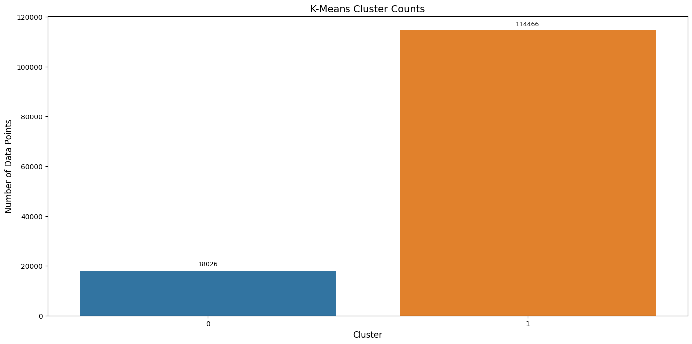
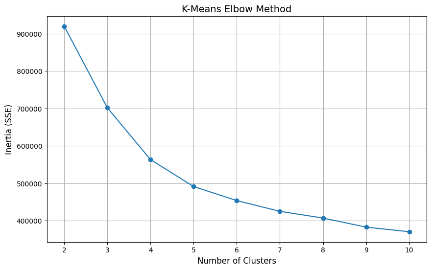
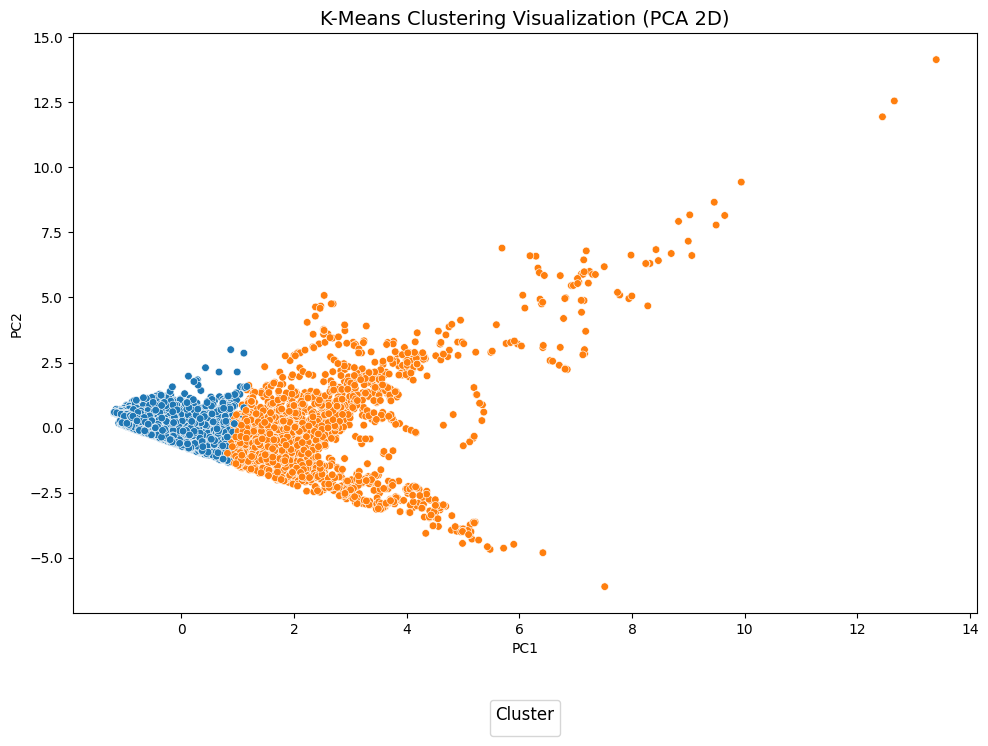
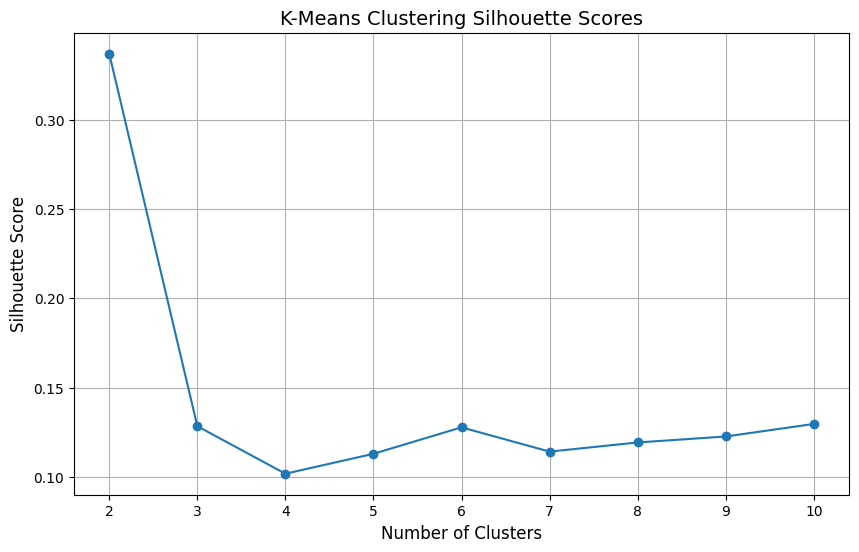
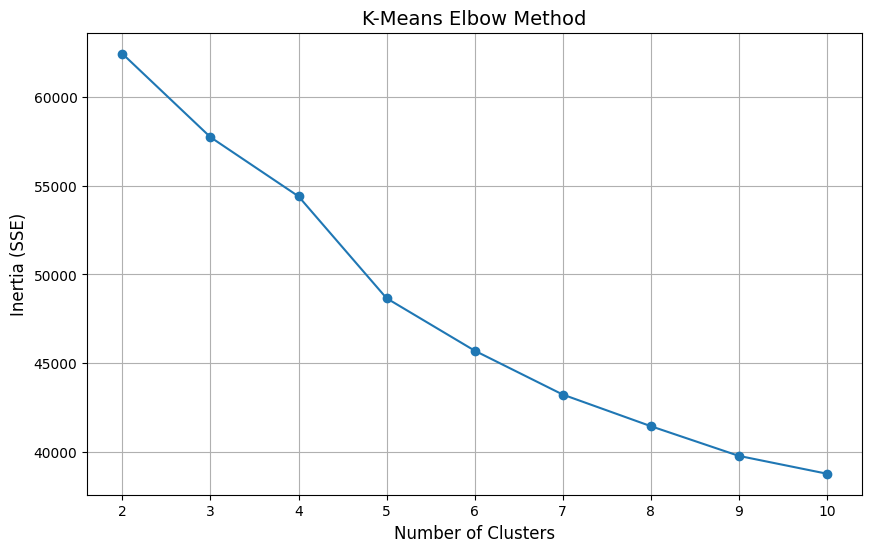
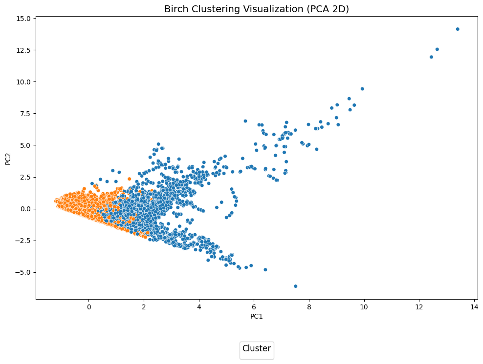

# Clustering

## Overview

This section contains the implementation, results, and documentation for clustering analysis conducted on the food delivery and restaurant datasets. The aim of clustering was to identify inherent groupings within the datasets to provide actionable insights into customer behavior and operational patterns.

We applied the following clustering algorithms:

- **K-Means**: Partition-based clustering.
- **DBSCAN**: Density-based clustering.
- **Birch**: Hierarchical clustering using the Birch algorithm.

## Folder Structure

- `clustering_algorithms.py`: Implements K-Means, DBSCAN, and Birch clustering algorithms.
- `clustering_utils.py`: Utility functions for preprocessing, plotting, and evaluation.
- `run_clustering.py`: Main script to execute clustering and save results.
- **Results Directory**:
  - Contains cluster profiles, visualizations, and evaluation metrics for each clustering method.
- **CSV Files**:
  - `*_cluster_profiles.csv`: Mean feature values for each cluster.
  - `*_clusters.csv`: Cluster assignments for all data points.

## Clustering Methods and Results

### 1. K-Means Clustering

- **Overview**:
  - K-Means clustering partitions the dataset into *k* clusters based on feature similarity.
  - The optimal number of clusters was determined using the elbow method and silhouette scores.

- **Delivery Dataset**:
  - **Optimal number of clusters**: 2.
  - **Evaluation Metrics**:
    - **Silhouette Score**: 0.415
    - **Davies-Bouldin Index**: 1.320
    - **Calinski-Harabasz Index**: 42819.013
  - **CSV Files**:
    - `Delivery_cluster_profiles.csv`: Average feature values for each cluster, providing insights into the characteristics of each group.
    - `Delivery_clusters.csv`: Each row maps a data point to its respective cluster.
  - **Visualizations**:
    - **Cluster Counts**
      
      
      **Interpretation**: Cluster 1 contains the majority of the data points, while Cluster 0 has fewer data points.
      
    - **Clusters (PCA 2D)**
      
      
      **Interpretation**: Cluster 0 appears more compact, while Cluster 1 is more dispersed.
      
    - **Silhouette Scores**
      
      
      **Interpretation**: The highest silhouette score is achieved with 2 clusters, justifying the optimal number of clusters.
      
    - **Elbow Method**
      
      
      **Interpretation**: The elbow point is at k=2, indicating diminishing returns for additional clusters.

- **Restaurant Dataset**:
  - **Optimal number of clusters**: 2.
  - **Evaluation Metrics**:
    - **Silhouette Score**: 0.337
    - **Davies-Bouldin Index**: 1.603
    - **Calinski-Harabasz Index**: 3,618.681
  - **CSV Files**:
    - `Restaurant_cluster_profiles.csv`: Average feature values for each cluster, providing insights into the characteristics of each group.
    - `Restaurant_clusters.csv`: Each row maps a data point to its respective cluster.
  - **Visualizations**:
    - **Cluster Counts**
      
      
    - **Clusters (PCA 2D)**
      
      
    - **Silhouette Scores**
      
      
    - **Elbow Method**
      
      
      **Interpretation**: Visualizations provided insights similar to the delivery dataset.

### 2. DBSCAN Clustering

- **Overview**:
  - DBSCAN is a density-based clustering algorithm that identifies dense regions as clusters.
  - Parameters such as `eps` (distance threshold) and `min_samples` were tuned to find optimal clusters.

- **Delivery Dataset**:
  - **Optimal parameters**: `eps=0.5`, `min_samples=10`.
  - **Evaluation Metrics**:
    - **Silhouette Score**: 0.212
    - **Davies-Bouldin Index**: 1.971
    - **Calinski-Harabasz Index**: 598.234
  - **CSV Files**:
    - `DBSCAN_Delivery_cluster_profiles.csv`: Profiles of non-noise clusters.
    - `DBSCAN_Delivery_clusters.csv`: Includes noise points assigned with label -1.
  - **Visualizations**:
    - **Cluster Counts**
      
      
      **Interpretation**: Most data points were labeled as noise, resulting in a sparse cluster distribution.
      
    - **Clusters (PCA 2D)**
      
      
      **Interpretation**: Dense clusters were detected, but noise accounted for a significant portion of the dataset.

- **Restaurant Dataset**:
  - **Optimal parameters**: `eps=0.3`, `min_samples=15`.
  - **Evaluation Metrics**:
    - **Silhouette Score**: 0.877
    - **Davies-Bouldin Index**: 0.212
    - **Calinski-Harabasz Index**: 2716.730
  - **CSV Files**:
    - `DBSCAN_Restaurant_cluster_profiles.csv`: Profiles of non-noise clusters.
    - `DBSCAN_Restaurant_clusters.csv`: Includes noise points assigned with label -1.
  - **Visualizations**:
    - **Cluster Counts**
      
      
    - **Clusters (PCA 2D)**
      
      
      **Interpretation**: Cluster Counts and PCA 2D plots highlight sparse clusters with high noise levels.

### 3. Birch Clustering

- **Overview**:
  - Birch clustering uses hierarchical clustering and cluster threshold tuning.
  - The dendrogram visualizes the hierarchical structure of the clusters.
  - Optimal parameters were determined using silhouette scores.

- **Delivery Dataset**:
  - **Optimal parameters**: `threshold=0.5`, `n_clusters=2`.
  - **Evaluation Metrics**:
    - **Silhouette Score**: 0.410
    - **Davies-Bouldin Index**: 0.936
    - **Calinski-Harabasz Index**: 28,285.033
  - **CSV Files**:
    - `Birch_Delivery_cluster_profiles.csv`: Average feature values for each cluster.
    - `Birch_Delivery_clusters.csv`: Each row maps a data point to its respective cluster.
  - **Visualizations**:
    - **Cluster Counts**
      
      
      **Interpretation**: Similar to K-Means, two distinct clusters were identified with imbalanced distributions.
      
    - **Clusters (PCA 2D)**
      
      
      **Interpretation**: The clusters align closely with the K-Means output, confirming consistency.
      
    - **Dendrogram**
      
      
      **Interpretation**: Highlights the hierarchical relationship between subclusters.

- **Restaurant Dataset**:
  - **Optimal parameters**: `threshold=0.5`, `n_clusters=2`.
  - **Evaluation Metrics**:
    - **Silhouette Score**: 0.319
    - **Davies-Bouldin Index**: 1.680
    - **Calinski-Harabasz Index**: 3,368.504
  - **CSV Files**:
    - `Birch_Restaurant_cluster_profiles.csv`: Average feature values for each cluster.
    - `Birch_Restaurant_clusters.csv`: Each row maps a data point to its respective cluster.
  - **Visualizations**:
    - **Cluster Counts**
      
      
    - **Clusters (PCA 2D)**
      
      
    - **Dendrogram**
      
      
      **Interpretation**: Cluster Counts, PCA 2D, and Dendrogram visualizations were consistent with the delivery dataset.

## Running Clustering

1. **Navigate to the Clustering Folder**:

    ```bash
    cd CW_Progress/Coursework_Code_Files/Clustering
    ```

2. **Run the Clustering Script**:

    ```bash
    python run_clustering.py
    ```

3. **View Results**:
   - Results (e.g., visualizations and evaluation metrics) will be saved in the `Results` directory for each clustering method.

## Key Findings

- The **K-Means** algorithm achieved the best clustering performance for both datasets in terms of silhouette score and other evaluation metrics.
- **Birch** clustering performed comparably but required parameter tuning.
- **DBSCAN** struggled due to the density variability in the datasets, producing a large number of small clusters.

## Folder Contents

- `clustering_algorithms.py`: Code for implementing clustering algorithms.
- `clustering_utils.py`: Functions for preprocessing, plotting, and evaluating clusters.
- `run_clustering.py`: Script to execute clustering workflows.
- **Results**: Contains clustering visualizations, evaluation metrics, and cluster profiles.
  - **CSV Files**: Include `*_cluster_profiles.csv` and `*_clusters.csv` for each clustering method and dataset.

## Future Improvements

- Experiment with more advanced clustering techniques such as Gaussian Mixture Models (GMMs).
- Further optimize parameters for DBSCAN and Birch.
- Investigate feature engineering for improved clustering performance.