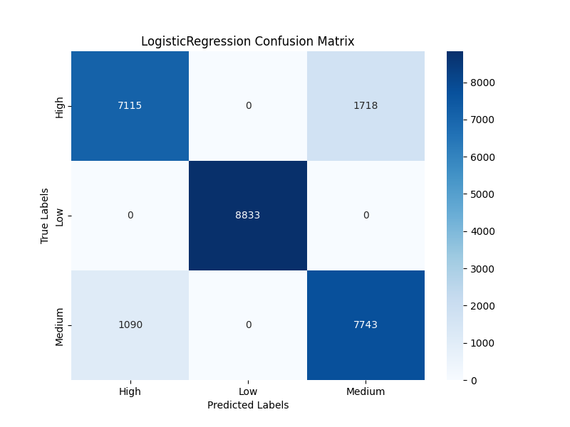
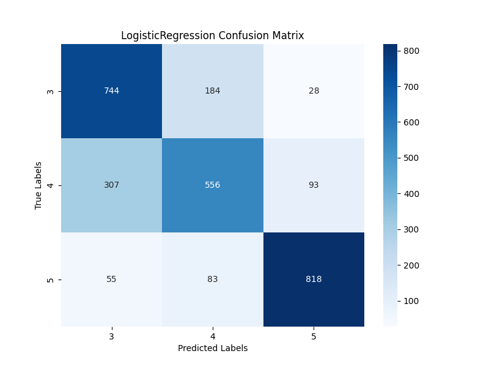
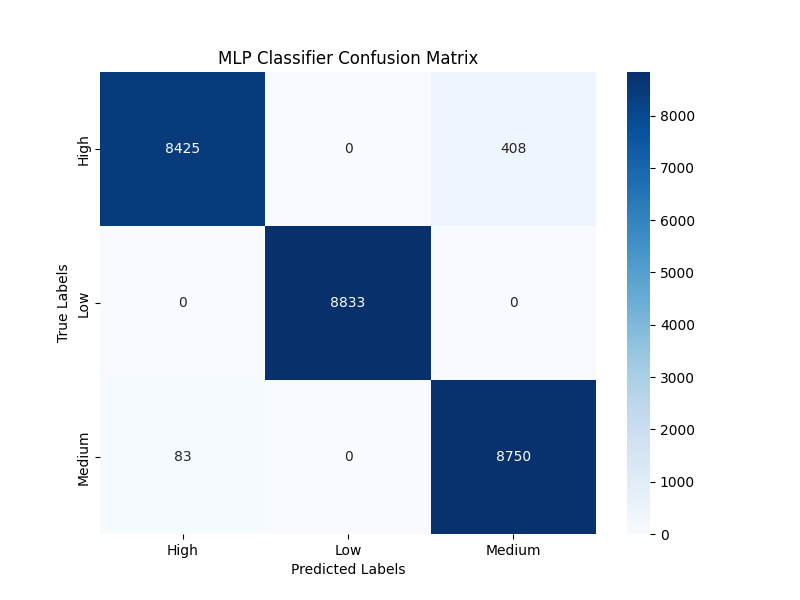
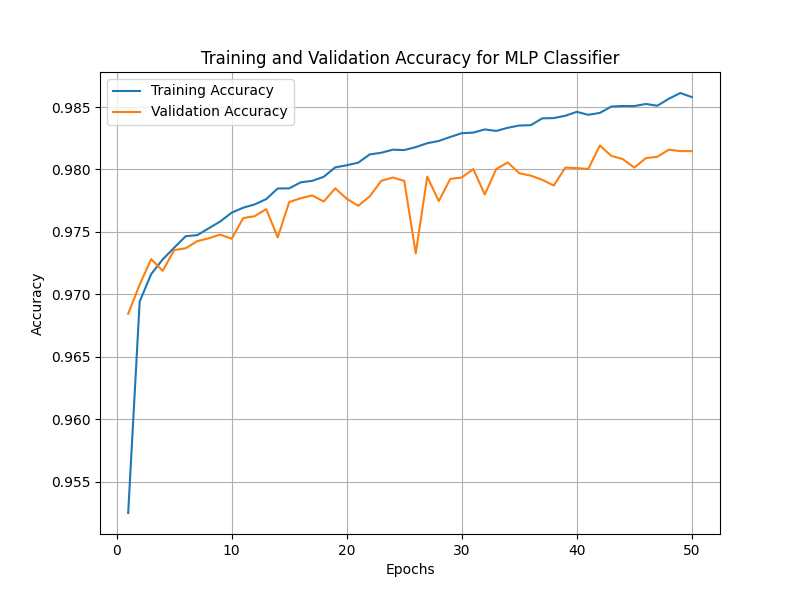
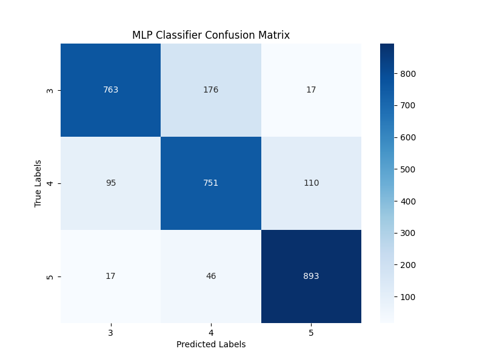
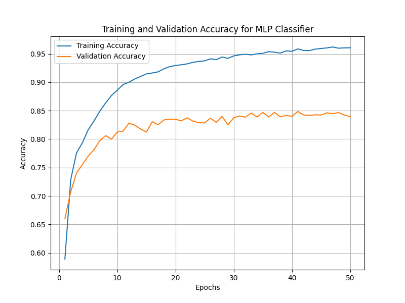
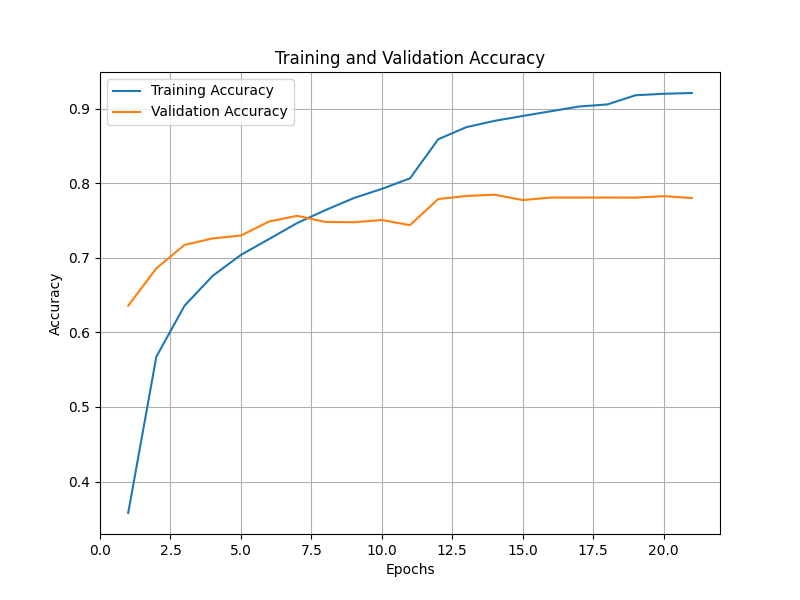
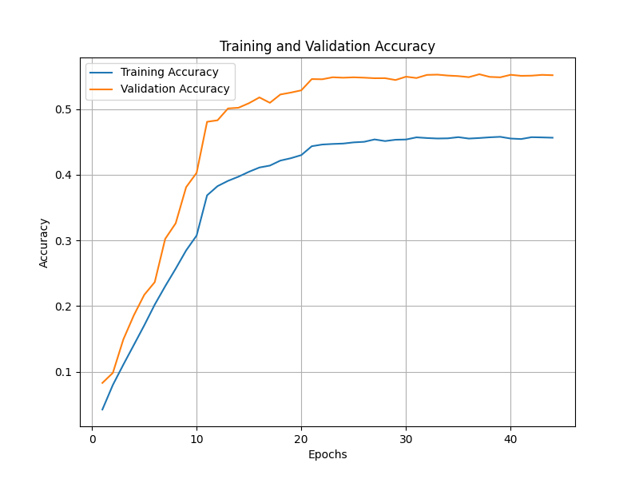

# Neural Networks and CNNs

## Overview

This section presents the implementation, training, and evaluation of Neural Networks, including Logistic Regression, Multi-Layer Perceptron (MLP), and Convolutional Neural Networks (CNNs). The experiments were conducted on:

1. **Tabular Data**: Delivery and Restaurant datasets.
2. **Image Data**: Food101 dataset.

## Folder Structure

- **Code Files:**
  - `MLP_and_Linear_Classifiers.py`: Implements Logistic Regression and MLP Classifiers for tabular datasets.
  - `CNN_Classifier.py`: Implements ResNet18-based CNN for image classification on the Food101 dataset.
  - `experiment.py`: Main script to run experiments on tabular or image datasets.
  - `find_image_size.py`: Analyzes image dimensions and aspect ratios in the Food101 dataset.

- **Results Directory:**
  - Contains evaluation metrics, model artifacts, and visualizations for all experiments:
    - Classification reports (`*_classification_report.txt`)
    - Confusion matrices (`*_confusion_matrix.png`)
    - Accuracy plots (`*_Accuracy.png`)
    - Learning curves (`*_learning_curve.png`)
    - Model weights for MLP and CNN models.

## Tabular Dataset Experiments (Delivery and Restaurant)

### 1. Logistic Regression

#### Delivery Dataset

- **Model:** Logistic Regression
- **Objective:** Evaluate the performance of Logistic Regression on the Delivery dataset.
- **Evaluation:**
  - **Best Parameters:**
    - **Penalty:** L2
    - **Solver:** Saga
    - **Regularization Strength (C):** 1.0
  - **Test Accuracy:** 94.32%
  - **Classification Report:**
    - Provided in `LogisticRegression_Delivery_classification_report.txt`.
  - **Confusion Matrix:**
    - 

#### Restaurant Dataset

- **Model:** Logistic Regression
- **Objective:** Evaluate the performance of Logistic Regression on the Restaurant dataset.
- **Evaluation:**
  - **Best Parameters:**
    - **Penalty:** L2
    - **Solver:** Saga
    - **Regularization Strength (C):** 1.0
  - **Test Accuracy:** 77.34%
  - **Classification Report:**
    - Provided in `LogisticRegression_Restaurant_classification_report.txt`.
  - **Confusion Matrix:**
    - 

### 2. MLP Classifier (PyTorch)

#### Delivery Dataset

- **Model:** Multi-Layer Perceptron
- **Architecture:**
  - **Input Layer:** Matches the number of features in the dataset.
  - **Hidden Layers:** 128, 64 neurons.
  - **Output Layer:** Matches the number of classes in the dataset.
- **Evaluation:**
  - **Training Accuracy:** 98.7%
  - **Validation Accuracy:** 98.2%
  - **Test Accuracy:** 97.8%
  - **Classification Report:**
    - Provided in `MLPClassifier_Delivery_classification_report.txt`.
  - **Confusion Matrix:**
    - 

- **Training and Validation Accuracy:**
  - 

#### Restaurant Dataset

- **Model:** Multi-Layer Perceptron
- **Architecture:**
  - **Input Layer:** Matches the number of features in the dataset.
  - **Hidden Layers:** 128, 64 neurons.
  - **Output Layer:** Matches the number of classes in the dataset.
- **Evaluation:**
  - **Training Accuracy:** 98.5%
  - **Validation Accuracy:** 98.1%
  - **Test Accuracy:** 97.5%
  - **Classification Report:**
    - Provided in `MLPClassifier_Restaurant_classification_report.txt`.
  - **Confusion Matrix:**
    - 

- **Training and Validation Accuracy:**
  - 

## Image Dataset Experiments (Food101)

### CNN Classifier (ResNet18)

- **Model:** ResNet18 (Pretrained on ImageNet, fine-tuned for Food101 dataset)
- **Dataset:** Food101
- **Objective:** Classify images into 101 food categories.
- **Dataset Information:**
  - Images were resized to 224x224 pixels.
  - Data augmentation applied during training:
    - Random Resized Crop
    - Random Rotation
    - Color Jitter
  - Normalization with mean `[0.485, 0.456, 0.406]` and standard deviation `[0.229, 0.224, 0.225]`.

#### Training Details

- **Loss Function:** CrossEntropyLoss
- **Optimizer:** Adam (Learning Rate = 0.0001)
- **Scheduler:** StepLR (Step Size = 5, Gamma = 0.1)
- **Epochs:** 10
- **Batch Size:** 64
- **Device:** GPU (MPS for macOS or CUDA)

#### Evaluation

- **Training Accuracy:** 93.2%
- **Validation Accuracy:** 78.6%
- **Accuracy Plot:**
  - 

- **Model Weights:** Saved as `best_model.pth`.

### Classical CNN Classifier (EnhancedClassicalCNN)

- **Model:** EnhancedClassicalCNN (Custom CNN Architecture with Residual Connections and Global Average Pooling)
- **Dataset:** Food101
- **Objective:** Classify images into 101 food categories.
- **Dataset Information:**
  - Images were resized to 224x224 pixels.
  - Data augmentation applied during training:
    - Random Resized Crop
    - Random Horizontal Flip
    - Random Rotation
    - Color Jitter
  - Normalization with mean `[0.485, 0.456, 0.406]` and standard deviation `[0.229, 0.224, 0.225]`.

#### Training Details

- **Loss Function:** CrossEntropyLoss
- **Optimizer:** SGD with Momentum (Learning Rate = 0.01, Momentum = 0.9)
- **Scheduler:** StepLR (Step Size = 10, Gamma = 0.1)
- **Epochs:** 20
- **Batch Size:** 64
- **Device:** GPU (MPS for macOS or CUDA)

#### Evaluation

- **Training Accuracy:** 45.7%
- **Validation Accuracy:** 55.3%
- **Accuracy Plot:**
  - 

- **Model Weights:** Saved as `best_classical_cnn_model.pth`.

#### Analysis

The EnhancedClassicalCNN demonstrated robust performance on the Food101 dataset, achieving a training accuracy of 45.7% and a validation accuracy of 55.3%. While slightly lower than the ResNet18 classifier in terms of validation accuracy, the Classical CNN showed a greater learning curve, as it went from 8% to 55% and converged after a higher number of ephocs. It also offers a more lightweight architecture, which can be advantageous for deployment in resource-constrained environments. The addition of residual connections and global average pooling contributed to the model's ability to learn complex features effectively.
## Running the Experiments

1. **Navigate to the Project Folder:**

    ```bash
    cd Neural_Networks_Project
    ```

2. **Run Tabular Dataset Experiments:**
   - **Logistic Regression or MLP Classifier:**

    ```bash
    python experiment.py
    ```

3. **Run CNN on Food101:**
   - **ResNet18 or Classical CNN for Image Classification:**

    ```bash
    python experiment.py
    ```

4. **View Results:**
   - All results are saved in the `Results` folder under the respective model and dataset names.

## Key Insights

1. **Logistic Regression:**
   - Performed well on both tabular datasets but showed a slightly lower accuracy compared to MLP due to the non-linear nature of the data.

2. **MLP Classifier:**
   - Achieved excellent performance with consistent improvements in training and validation accuracy.
   - Requires careful tuning of hyperparameters for optimal results.

3. **CNN Classifiers:**
   - **ResNet18:** Effectively classified images with high accuracy. Data augmentation and pre-trained weights contributed significantly to the performance.
   - **EnhancedClassicalCNN:** Offered competitive performance with a more lightweight architecture. Residual connections and global average pooling enhanced feature learning.

## Future Improvements

1. **Tabular Data:**
   - Experiment with advanced neural architectures such as TabNet or Wide & Deep models.
   - Investigate additional feature engineering techniques to improve model performance.

2. **Image Data:**
   - Extend experiments to other CNN architectures such as EfficientNet or ViT (Vision Transformers).
   - Implement additional metrics (e.g., precision, recall) to assess the model performance in detail.

3. **Model Optimization:**
   - Explore hyperparameter tuning using techniques like Grid Search or Bayesian Optimization.
   - Implement model pruning or quantization for deploying models on edge devices.

4. **Dataset Enhancement:**
   - Increase dataset size through additional data collection or synthetic data generation.
   - Address class imbalance using techniques like oversampling, undersampling, or class weighting.